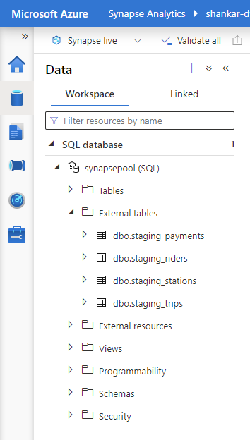

# Building an Azure Data Warehouse for Bike Share Data Analytics
This Project, Building an Azure Data Warehouse for Bike Share Data Analytics is built as a part of Udacity Shell train2hire scholarship program.

Below is project descrption from the project page in Udacity

Divvy is a bike sharing program in Chicago, Illinois USA that allows riders to purchase a pass at a kiosk or use a mobile application to unlock a bike at stations around the city and use the bike for a specified amount of time. The bikes can be returned to the same station or to another station. The City of Chicago makes the anonymized bike trip data publicly available for projects like this where we can analyze the data. The dataset looks like this:

The goal of this project is to develop a data warehouse solution using Azure Synapse Analytics. We will:

- Design a star schema based on the business outcomes listed below;
- Import the data into Synapse;
- Transform the data into the star schema;
- and finally, view the reports from Analytics.

The business outcomes we are designing for are as follows:
1. Analyze how much time is spent per ride
- Based on date and time factors such as day of week and time of day
- Based on which station is the starting and / or ending station
- Based on age of the rider at time of the ride
- Based on whether the rider is a member or a casual rider
2. Analyze how much money is spent
- Per month, quarter, year
- Per member, based on the age of the rider at account start
3. Analyze how much money is spent per member
- Based on how many rides the rider averages per month
- Based on how many minutes the rider spends on a bike per month

# Steps To Reproduce The project

## Step 1
## Create Resources

Create an **Azure Synapse Workspace** and **Azure Storage Account**

## Step 2
## star schema

Below is the star schema design to answer business questions

## Step 3
## Create data tables in PostgreSQL

Create an **Azure PostgreSQL Database** (use Flexible Server, workload type development, add a firewall rule to allow access from any azure service)

Run **python DataToPostgres.py** in order to populate the PostgreSQL database. 

## Step 4
## Extract data from PostgreSQL

use the ingest wizard to create a one-time pipeline that ingests the data from PostgreSQL into Azure Blob Storage

1. Create an **Azure Database for PostgreSQL** linked service and **Azure Blob storage** linked service

2. in order to ingest data into **Blob Storage**,  Go to the **Home/Ingest** section and select **Built-in copy task** and **Run once now**.

3. Then select **Azure Database for PostgreSQL** as a source and choose all the relevant tables.

4. Then add a destination link to **Azure Blob Storage** as a source and In the storage account, you should see the four datasets copied in from postgres

**All the scripts used are updated to the scipts folder of this repo**
## Step 5
## LOAD the data into external tables in the data warehouse

From Blob storage, the files in the Synapse Workspace we can use the script generating function to load the data from blob storage into external staging tables in the data warehouse we created using the Dedicated SQL Pool.

## Step 6
## Transform the data to the star schema
We will write SQL scripts to transform the data from the staging tables to the final star schema we designed. SQL scripts are in the repo
**All the scripts used are updated to the scipts folder of this repo**

